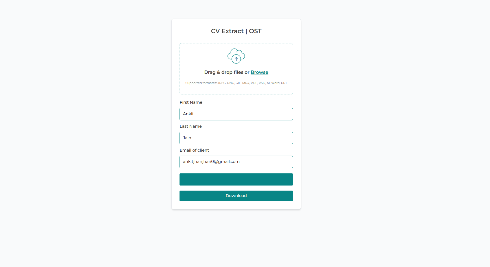

# OST Frontend

OST Frontend is a React.js project that provides a user-friendly interface for uploading resumes, parsing them with a backend application, and downloading the extracted data in an Excel file. It also supports sharing the Excel file via email with a custom template.

| Label    | Image URL                                               |
|----------|---------------------------------------------------------|
| Landing  |                            |
| Uploading|                        |
| Confetti |                          |
| Progress |                          |
| Email    |                                |
| Email Sent    |                                |

## Features

- Upload resumes using drag and drop or browse events.
- Display progress bar during uploading.
- Parse uploaded resumes with a backend application.
- Download extracted data in an Excel file.
- Share Excel file via email with a custom template.

## Installation

1. Clone the repository:

   ```bash
   git clone https://github.com/AnkitJain78/OST_Frontend.git

2. Navigate to the project directory:

   ```bash
   cd OST_Frontend

5. Setup .env file:

   ```bash
   REACT_APP_API_URL=
   
3. Install dependencies:

   ```bash
   npm install

4. Start the development server:

   ```bash
   npm start
   
5. Access the application at http://localhost:3000.

## Usage

- **Upload Resumes:**
  - Drag and drop or browse to upload resume files.
  - Progress bar will be displayed during the upload process.

- **Parse Resumes:**
  - After uploading resumes, the backend application will parse them automatically.

- **Download Excel File:**
  - Once parsing is complete, download the extracted data in an Excel file using the download button.

- **Share via Email:**
  - Share the Excel file via email using the share button.
  - The backend application will process the email and send it with a custom template.

## Technologies Used

- React.js: JavaScript library for building user interfaces.
- Axios: Promise-based HTTP client for making API requests.
- Backend Application: Django backend application for parsing resumes and sending emails.
- Nodemailer: Node.js module for sending emails.

## License

This project is licensed under the MIT License - see the [LICENSE](LICENSE) file for details.
